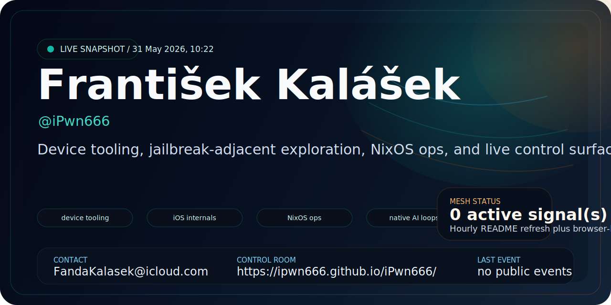
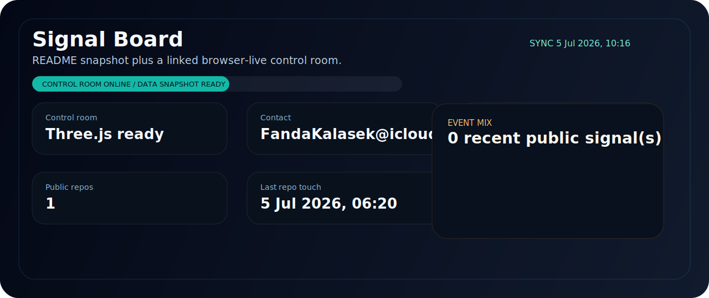
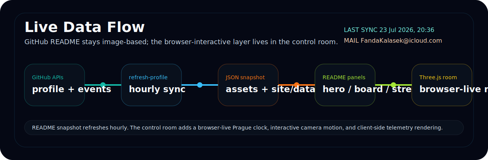
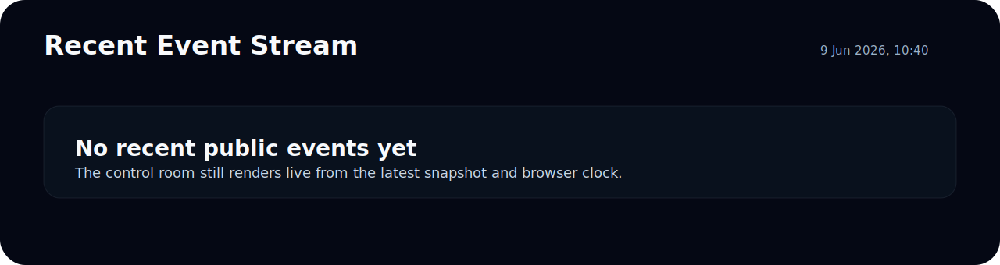

  

  
  
  
  

  <a href="#signal-board">Signal Board</a> /
  <a href="#build-lanes">Build Lanes</a> /
  <a href="#live-data-flow">Live Data Flow</a> /
  <a href="#live-control-room">Live Control Room</a> /
  <a href="#event-stream">Event Stream</a> /
  <a href="#working-interface">Working Interface</a>

  <code>device tooling</code>
  <code>iOS internals</code>
  <code>NixOS ops</code>
  <code>native automation</code>
  <code>AI-assisted workflows</code>

## Signal Board

I build things that sit close to the machine: device tooling, operational automation, native experiments, and feedback-heavy interfaces. The profile below is no longer a static intro card; it now carries a small live telemetry layer sourced from the GitHub API and refreshed by Actions.

  

## Build Lanes

| Lane | What that means in practice |
| --- | --- |
| Device tooling | Scripts, helpers, and operator-grade flows that remove repetitive manual steps. |
| iOS internals | Reverse-engineering-adjacent exploration, jailbreak ecosystem curiosity, and native debugging workflows. |
| NixOS ops | Reproducible workstation setup, system automation, timers, audits, and controlled rollout habits. |
| Native AI loops | Fast experiments where local tooling, LLMs, and UI feedback stay tightly connected. |

## Live Data Flow

  

The generated snapshot that drives the panels above lives in [assets/live-data.json](./assets/live-data.json). The README layer stays image-based, while the linked control room adds a browser-live Prague clock, camera motion, and a Three.js scene fed by the same snapshot data.

## Live Control Room

The profile README itself cannot execute inline JavaScript or Three.js, so the heavy interactive layer lives here instead:

- [Open the live control room](https://ipwn666.github.io/iPwn666/)
- [Source snapshot for the control room](./site/data/live-data.json)
- [Primary contact](mailto:FandaKalasek@icloud.com)

## Event Stream

  

## Working Interface

  
<strong>How I prefer to build</strong>

   

  - Short loops beat heroic rewrites.
  - Instrumentation comes before guesswork.
  - Good tooling should remove friction, not just move it around.
  - I like interfaces that feel alive: status, motion, progress, and meaningful signal density.

  
<strong>Stack I reach for</strong>

   

  | Surface | Tools |
  | --- | --- |
  | Frontend | `React`, `Next.js`, `TypeScript`, `Expo`, `Tailwind CSS` |
  | Native and systems | `Swift`, `Objective-C`, `Bash`, `Nix`, `Node.js` |
  | Infra and delivery | `Docker`, `GitHub Actions`, `PostgreSQL`, `Redis`, `AWS` |
  | Observability | logs, dashboards, tiny control panels, and scripts that tell the truth fast |

  
<strong>What changed in this repo</strong>

   

  - Replaced the generic README with a profile that better matches the actual work.
  - Added generated SVG panels with live GitHub-derived telemetry and a real timestamped data-flow panel.
  - Added a Three.js-powered control room published through GitHub Pages.
  - Added an hourly GitHub Actions refresh loop so the snapshot keeps moving without manual edits.

## GitHub Pulse

  

  <a href="https://topwnz.com"><strong>topwnz.com</strong></a>
  /
  <a href="mailto:FandaKalasek@icloud.com"><strong>mail</strong></a>
  /
  <a href="https://ipwn666.github.io/iPwn666/"><strong>control room</strong></a>
  /
  <a href="https://github.com/iPwn666"><strong>github</strong></a>

  Profile assets are generated from live GitHub data, committed back into the repo, and mirrored into a browser-interactive control room.

