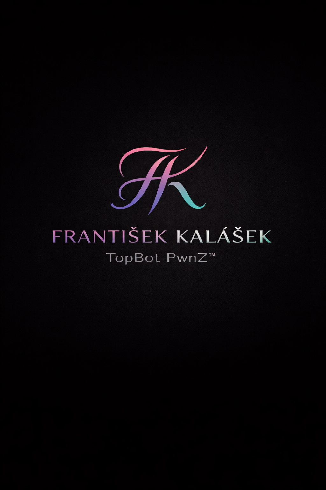

  

<h1 align="center">Frantisek Kalasek</h1>
<h3 align="center">TopBot PwnZ&trade;</h3>

  <em>"Bridge the gap, create the world."</em>

  Full-stack Engineer | Cloud/DevOps | PWA Specialist

  <a href="https://topwnz.com"><strong>Portfolio</strong></a> |
  <a href="mailto:FandaKalasek@icloud.com"><strong>Email</strong></a> |
  <a href="https://github.com/iPwn666"><strong>GitHub</strong></a>

---

## About

I build **cloud-native web apps** and **Progressive Web Apps (PWA)** that prioritize **performance, reliability, and maintainability**.

### What I Offer

- **End-to-end delivery**: Design to implementation to deployment to monitoring
- **Cloud & DevOps**: Architecture, CI/CD, automation, observability
- **Security-conscious**: Sensible defaults, least privilege, secure-by-design mindset
- **User-centered thinking**: Healthcare background brings clear communication and empathy

---

## Services

### Product & Web Engineering
- PWA / Web apps (offline-first, push, app-shell patterns)
- Full-stack development (APIs, auth, data modeling, integrations)
- UI engineering (clean UX, accessible UI, performance budgets)

### Cloud & DevOps
- Cloud architecture (AWS / Azure / GCP), Kubernetes & containerized workloads
- Infrastructure as Code (Terraform), repeatable environments
- CI/CD pipelines, automated testing & deployments
- Monitoring & optimization (reliability, performance, cost awareness)

---

## Tech Stack

  
  
  
  
  
  
  
  
  

---

## Business Information

| Field | Value |
|-------|-------|
| **Name** | Frantisek Kalasek |
| **Business ID (ICO)** | 23628588 |
| **Legal Form** | Self-employed Individual (OSVČ) |
| **Established** | August 21, 2025 |
| **Registration** | Ministry of Industry and Trade (MPO) |
| **Location** | Czech Republic |

---

## Contact

- **Email**: FandaKalasek@icloud.com
- **Phone**: +420 722 426 195
- **Address**: Javorek 54, 59203 Javorek, Czechia
- **Portfolio**: [topwnz.com](https://topwnz.com)
- **GitHub**: [@iPwn666](https://github.com/iPwn666)

---

## How I Work

- Clear scope, written assumptions, and transparent tradeoffs
- Frequent progress updates (short demos > long meetings)
- Clean code, docs where it matters, and maintainable delivery
- Pragmatic engineering: build what moves the needle, then harden it

---

  <strong>Languages:</strong> Czech (native) | English (C1)

  &copy; 2025 Frantisek Kalasek. All rights reserved.

